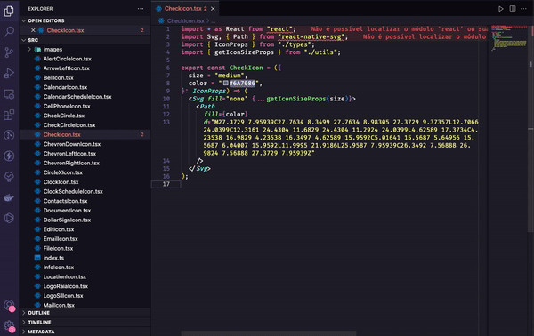

# SVGR Preview

An essential extension for Visual Studio Code, purpose-built for React and React Native developers. With this extension, you can gain a visual preview of exported SVG files, seamlessly incorporating them directly into your JavaScript (JS), JavaScript React (JSX), and TypeScript React (TSX) files. Simplifying the way you interact with graphical elements, it delivers a more immersive and efficient development experience.

## Features

- Visualize SVG files directly in your React and React Native projects.
- Real-time preview updates as you make changes to your SVG files.
- Interact with different SVG variants and states within the preview.
- Supports a wide range of SVG formats, from simple graphics to intricate illustrations.
- Customize the display settings to match your development style.
- Compatible with React Native projects for mobile development.

## Installation

1. Open Visual Studio Code.
2. Go to the Extensions view (click on the square icon in the sidebar on the left).
3. Search for "SVGR Preview" and click Install.
4. Once installed, you're ready to enhance your SVG workflow.

## Usage

1. Open a JavaScript (JS), JavaScript React (JSX), or TypeScript React (TSX) file.
2. Locate an SVG import or create a new one.
3. The preview should automatically display the SVG.
4. Make edits to the SVG file, and observe the real-time updates in the preview.
5. Interact with the SVG preview to evaluate animations, transitions, and different states.

## Contributing

Contributions are welcome! Feel free to open issues and submit pull requests. Please make sure to follow our [Code of Conduct](CODE_OF_CONDUCT.md).

## License

This project is licensed under the [MIT License](LICENSE).

---

Created with ❤️ by [Godrix](https://www.linkedin.com/in/carlosgodri/)

